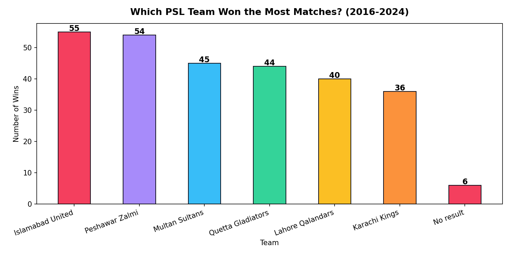
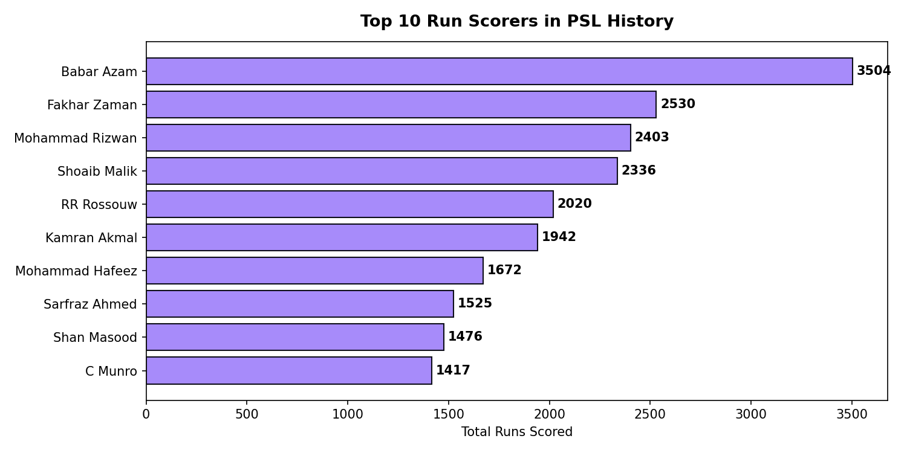
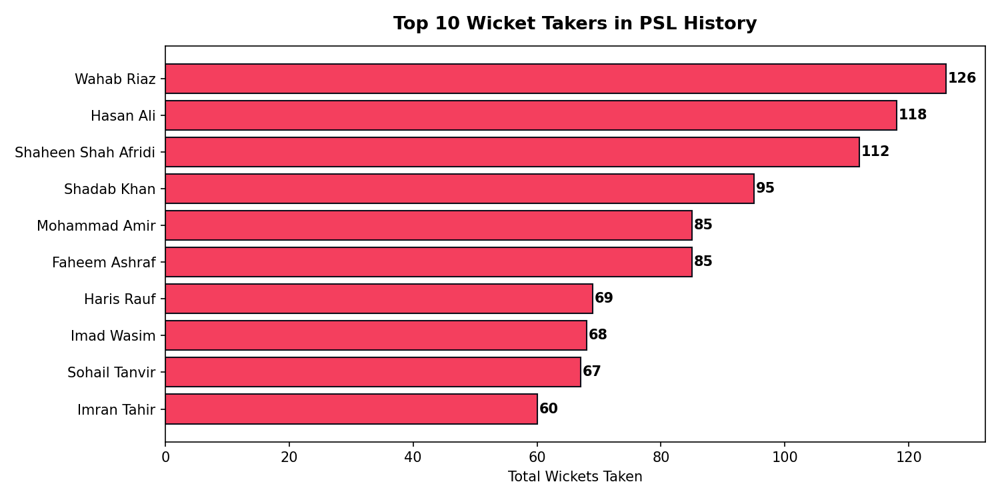
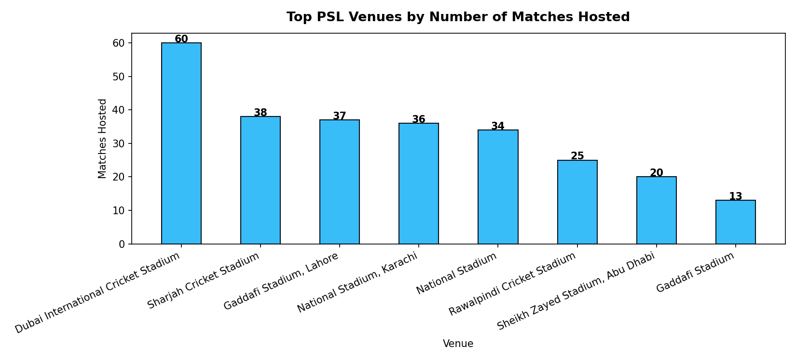
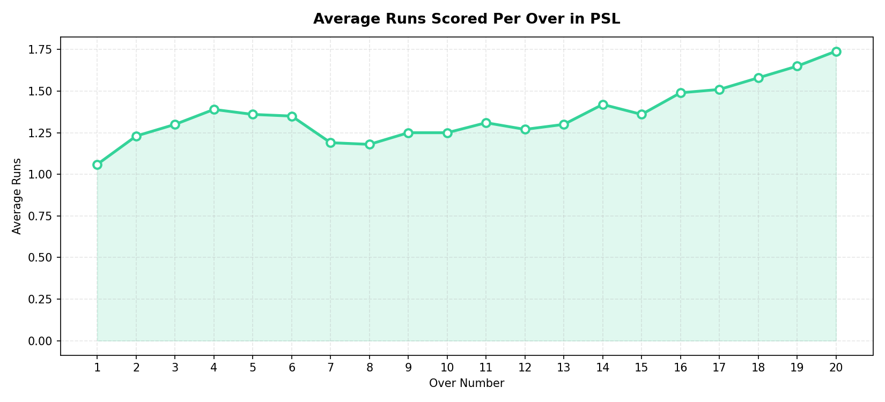
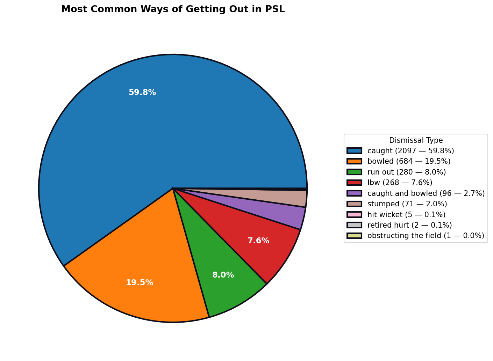

# 🏏 PSL Data Analysis (2016–2024)

Ball-by-ball data analysis of every Pakistan Super League match from 2016 to 2024 — built with Python, Pandas, and Matplotlib, with an interactive Streamlit dashboard on top.

**Built by Mehr Hussain** | AI Engineer | Karachi

🔗 **Live Demo:** https://mehrdeveloper.github.io/PSL-Analysis/

---

## 📌 What This Project Does

This project takes a raw ball-by-ball PSL dataset (one row = one ball bowled) and answers 6 real cricket questions:

1. Which team won the most matches?
2. Who are the top 10 run scorers in PSL history?
3. Who are the top 10 wicket takers in PSL history?
4. Which venues hosted the most matches?
5. What's the average number of runs scored per over?
6. What are the most common ways batters get out?

The results are shown both as static charts (`analysis.py`) and as a live, filterable web dashboard (`app.py`) where you can pick a season and watch every chart update instantly.

---

## 🛠️ Tech Stack

| Tool | Purpose |
|---|---|
| **Pandas** | Cleaning and analyzing the raw ball-by-ball data |
| **Matplotlib** | Drawing all 6 charts |
| **Streamlit** | Turning the analysis into an interactive web dashboard |
| **NumPy** | Backing numerical operations under Pandas |

---

## 📊 Results

### 1. Which Team Won the Most Matches?


### 2. Top 10 Run Scorers


### 3. Top 10 Wicket Takers


### 4. Top Venues by Matches Hosted


### 5. Average Runs Per Over


### 6. How Batters Get Out


---

## 🔑 Key Findings

- **Most match wins:** Islamabad United (55 wins)
- **Top run scorer:** Babar Azam (3,504 runs)
- **Top wicket taker:** Wahab Riaz (126 wickets)
- **Total sixes hit:** 3,433
- **Total fours hit:** 7,689
- **Total wickets fallen:** 3,504
- Scoring dips slightly in the middle overs (7–8) and rises sharply in the last 5 overs (16–20), a typical T20 pattern.
- **Caught** is by far the most common dismissal (59.8%), followed by bowled (19.5%).

---

## 🚀 Run It Locally

```bash
# 1. Clone this repository
git clone <your-repo-url>
cd <your-repo-folder>

# 2. Install dependencies
pip install -r requirements.txt

# 3. Run the static analysis (prints results + saves chart images)
python analysis.py

# 4. Run the interactive dashboard
python -m streamlit run app.py
```

The dashboard will open automatically in your browser at `http://localhost:8501`.

---

## 📁 Project Structure

```
├── analysis.py                          # Static analysis — prints results, saves 6 charts
├── app.py                               # Interactive Streamlit dashboard
├── requirements.txt                     # Python dependencies
├── Psl_Complete_Dataset(2016-2024).csv  # Raw ball-by-ball dataset
├── q1_team_wins.png                     # Chart 1
├── q2_top_batters.png                   # Chart 2
├── q3_top_bowlers.png                   # Chart 3
├── q4_venues.png                        # Chart 4
├── q5_runs_per_over.png                 # Chart 5
├── q6_dismissals.png                    # Chart 6
└── README.md
```

---

## 📈 About the Dataset

Each row represents a single ball bowled in a PSL match between 2016 and 2024 — including the batter, bowler, runs scored, extras, and wicket details for that ball. Match-level facts (like the winning team or venue) repeat across every ball of that match, which is accounted for in the analysis using `drop_duplicates()` on `match_id`.
